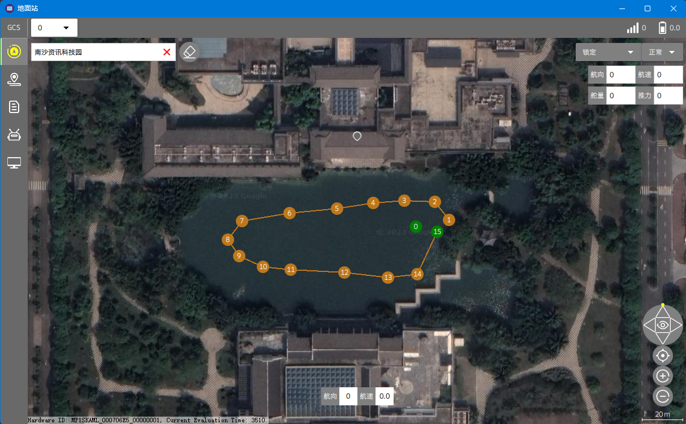
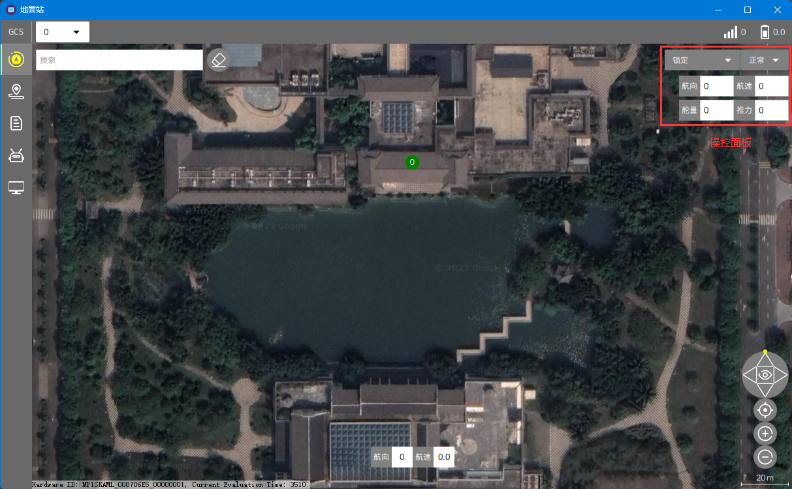
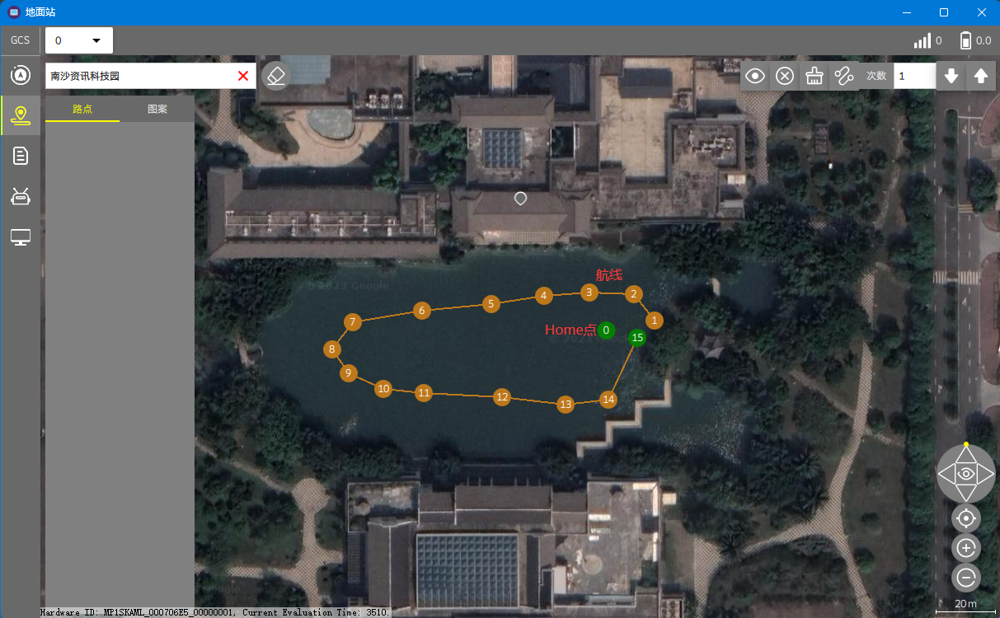
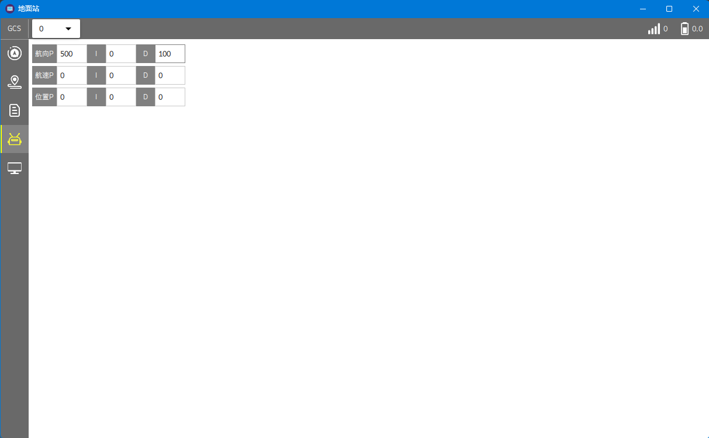
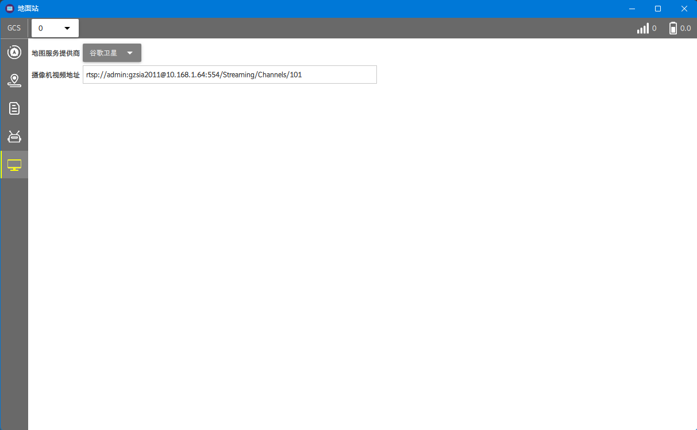
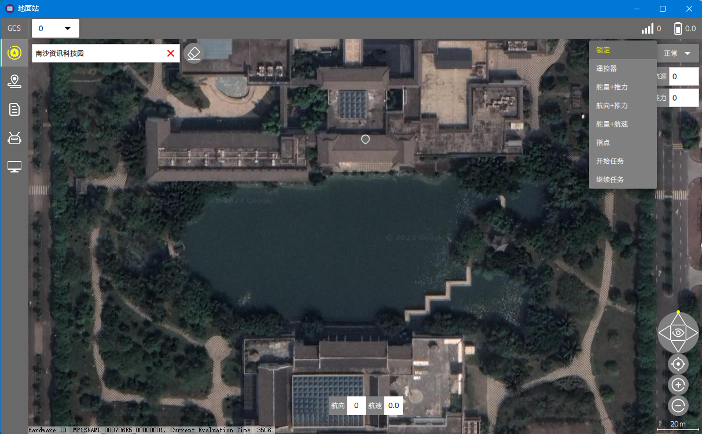
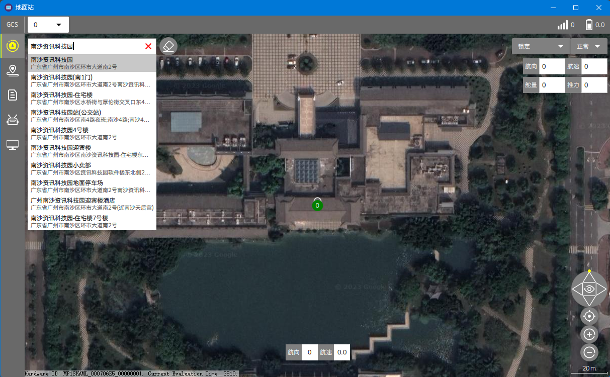

# 地面站

本节主要介绍软件常用的功能与按键操作演示。地面站的显示页面主要由导航栏、状态栏和中央地图页面组成，如下所示。为了保证界面简洁，大部分按键以图标的方式显示，鼠标悬停3秒即可显示提示信息。

## 导航栏选项卡

**操控选项卡**（航向0-360度、航速0-5米，舵量-1000到+1000负左正右、推力-1000到+1000负退正前）

**任务选项卡**
（点击任意位置可以添加任务点，中心按键可以使你所在位置居中，删除按键可以删除一个任务点、清除按键可以删除所有任务点、计算按键可以生成等间距点、执行次数默认为1，输入是0时表示回到第一个任务点，上传按键可以将任务上传到船控、下载按键可以将船控中的任务下载到地面站显示，搜索栏可以搜索位置）

**日志选项卡**（暂时没有开放）

**PID配置选项卡**（配置后保存在船控中）

**地面站配置选项卡**（地图服务提供商选择、视频流地址配置）

## 状态栏选项卡

右上状态栏显示所连接的无人船的通信延时和无人船的剩余电量百分比， 底部状态栏显示无人船当前的航向和航速

## 控制模式

* **锁定模式**：将控制权锁定，遥控器无法控制
* **遥控器模式**：将控制权交给遥控器
* **舵量+推力模式**：输入给定舵量和推力进行控制
* **航向+推力模式**：输入给定航向和推力进行控制
* **舵量+航速模式**：输入给定舵量和航速进行控制
* **指点模式**：通过鼠标拖动指点无人船进行跟踪
* **开始任务**：执行任务模式，从第一个任务点开始执行
* **继续任务**：执行任务模式，从之前执行点的下一个任务点开始继续执行

## 地图交互

* 对地图进行搜索
* 顺时针和逆时针旋转地图
* 改变地图的俯仰角度
* 对地图进行缩小和放大

## 快捷键

* **地图刷新**：可更新地图瓦片至最新：F5
* **地图平移**：上下左右箭头
* **地图旋转**：Ctrl+左右箭头
* **地图倾斜**：Ctrl+上下箭头
* **地图放缩**：鼠标滚轮、触摸板捏合和轻弹
