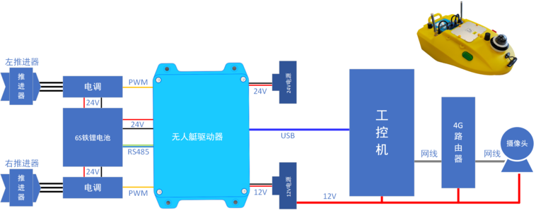

# 船体平台

全自动无人船平台可实现无人遥控，卫星自动导航，自主航行，自动避障，能够搭载不同的仪器设备进行多种领域的水上作业。可以最大限度地规避人员安全隐患，大大提高水下探测的机动性和效率。

系统包括主控系统、导航系统、通信系统、供电系统、推进系统、遥控器和地面站。

## 船体尺寸图

## 主要硬件介绍

### 硬件接线示意图

### 随船设备及用途介绍

* **无人艇驱动器**：无人艇正常运行的必要硬件，内部集成电源管理模块、GNSS导航模块、遥控器接收机、ESP32主控模块、串口管理模块等，控制无人船姿态
* **工控机**：运行外部控制程序及其它系统集成，给无人艇发送外部控制命令、感知信息、网络信号、差分信号等
* **推进器**：电机旋转带动桨叶，从而给无人艇行进提供动力
* **铁锂电池**：6S 15000mAh ，无人艇的动力来源，自带BMS
* **摄像头**： 用于实时视频回传
* **组网模块**： 实现组网及数据传输
