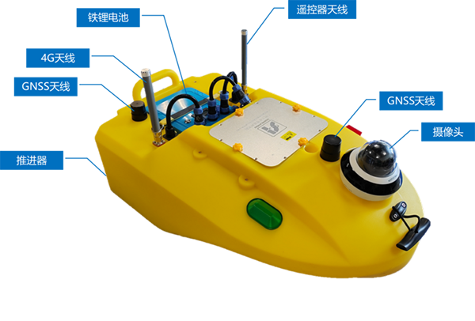

# 教程简介

SL900科教无人艇旨在为高等学校、科研院所和业余爱好者群体，提供高稳定性、高可靠性、高便捷性的无人船控制平台，及无人船感知、导航、控算和决策等专业学习教程。可应用于无人船学科探索、无人船竞赛、无人船巡检/检测/养殖等应用场景研究。借助该平台，用户能够快速搭建无人船控制平台、快速扩展高性能平台或传感器，以大幅度缩短控制平台研发周期，并可协助用户将更多精力集中在理论研究、算法论证、竞赛战术、产品研发等核心应用上。

教程主要分为四个部分，包括船体平台硬件组成、PID控制原理、遥控器使用说明、地面站使用说明。

## 系统概览



## 规格参数

| **型号**   | SL900-T        | **船体**    | 阻燃型PE高分子材料       |
|----------|----------------|-----------|------------------|
| **船体尺寸** | L950*W500*H390 | **吃水深度**  | <0.15m           |
| **船体重量** | 约15KG（含电池）     | **抗风浪级别** | 3级风、2级浪          |
| **最大航速** | > 4m/s         | **控制方式**  | 遥控、上位机软件         |
| **续航能力** | 约60分钟（15Ah电池）  | **通信方式**  | 4G LTE / RF 无线射频 |

```{attention}
以上参数仅供参考，因环境不同，参数可能有所不同，以实地测试为准。
```
