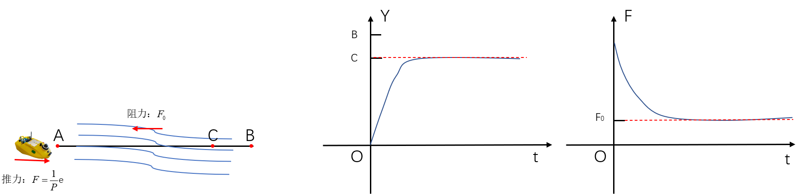
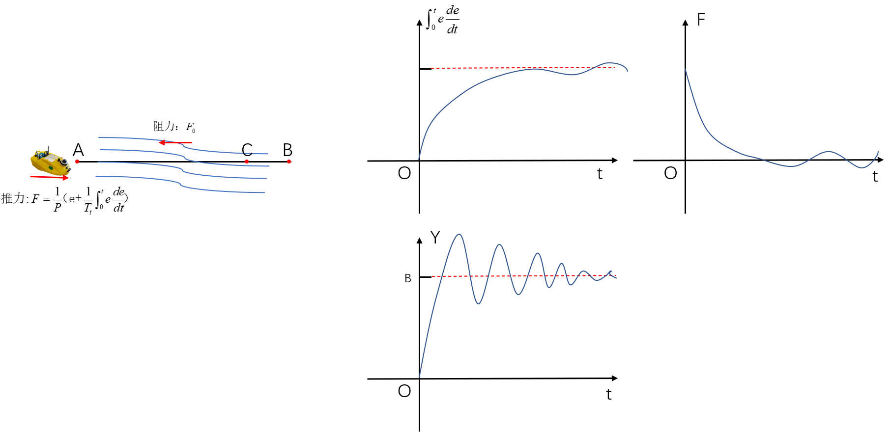
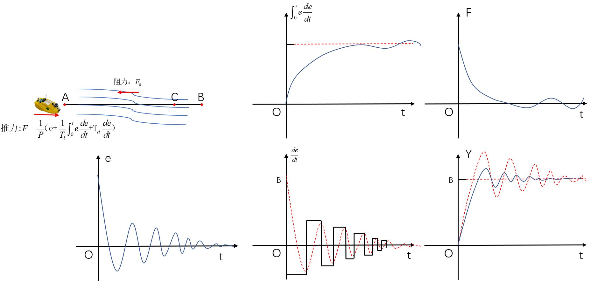

# PID控制原理

## PID公式

本节主要介绍PID控制原理，其计算公式如下图所示，通过控制比例项、积分项、微分项的比例系数达到接近期望值的目的。

## PID公式中各项的作用

**比例项的作用**
如下图所示，假设无人艇受到的推力F=e/P，受到的阻力为F0
，其中e等于无人艇当前位置与目标点B的距离，假设只有比例项作用，随着无人艇的位置靠近B点，无人艇受到的推力F逐渐减小，假如在C点位置是推力大小等于阻力，此时无人艇始终与目标点具有一定的距离。

**积分项的作用**
如上图只有比例项作用时，无人艇始终与目标点存在一定距离，故此时在比例项的基础上加入积分项，随着e在时间上的积分，积分值越来越大，最终F在比例项与积分项的作用下无人艇的位置可能超出目标点的位置，此时e为负值，在比例项的作用下，推力可能小于阻力导致无人艇后退，故无人艇位置在目标点位置震荡。

**微分项的作用**
为了让无人艇快速收敛到目标点位置，加入微分项，微分项描述的是e的变化趋势，通过减小e的变化趋势，进而减小震荡幅度，达到快速收敛的目的。

